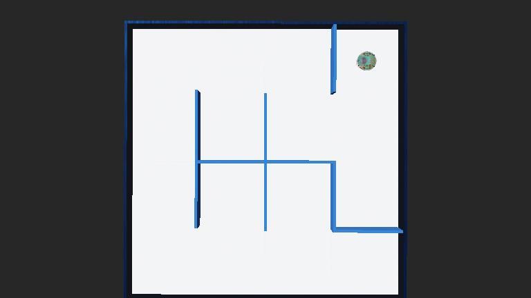

# Webots Maze Searcher Robot
## Project Objective
The primary objective of this project is to develop and demonstrate proficiency in implementing maze
traversal algorithms using a simulated robotic environment in Webots 2023b. Students are expected to
program an e-puck robot to autonomously navigate and traverse the entirety of a given maze.
Image below is the Maze in which the robot is supposed to traverse using two fundamental algorithms.


## Searching Algorithms
The project will focus on two fundamental algorithms:
1. **Depth-First Search (DFS)**: This algorithm explores as far as possible along each branch before
backtracking. It is well-suited for scenarios where you need to explore in a direction as long as possible
and then backtrack to explore other paths.

2. **Breadth-First Search (BFS)**: This algorithm explores all the nearest nodes at the present depth
prior to moving on to nodes at the next depth level. It is optimal for finding the shortest path and
ensuring that all accessible areas of the maze are explored.

The success of the project will be measured by the robot’s ability to:

  - Successfully navigates and maps the entire maze.
  - Demonstrate the chosen traversal algorithm’s effectiveness in real-time simulation.
  - Execute the traversal with minimal errors and without manual intervention.

This project not only tests technical skills in algorithm implementation but also assesses problem-solving
capabilities and understanding of autonomous robotic navigation principles.
## Results
The full report and the ```.py``` controller file are available in ```Report.pdf``` and ```./controllers/my_controller/my_controller.py```
### Breadth-first search (BFS)
https://github.com/user-attachments/assets/db975450-22da-489b-b288-dc65eb1ed1c7
### Depth-first search (DFS)
https://github.com/user-attachments/assets/f45a8ee7-8911-49b6-b142-783c702b9771
